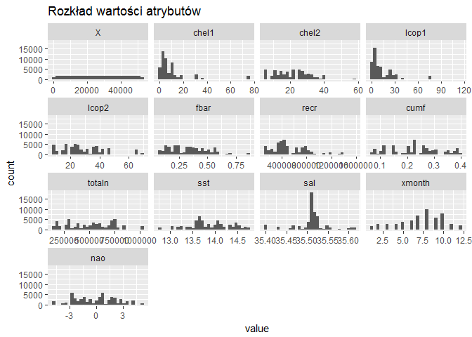
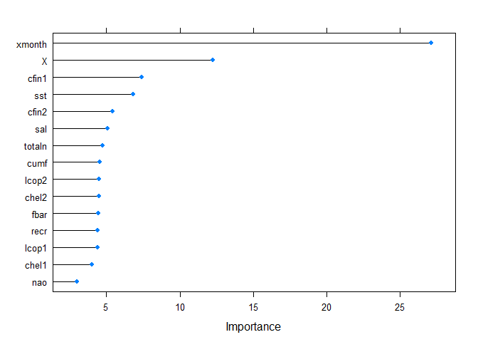

# Raport R - ZED
Tomasz Fabisiak  
22 listopada 2016  


# Raport

### 1 Wstęp.


Niniejszy raport ma na celu analizę zbioru danych dotyczących połowu śledzi atlantyckich z ostatnich 60 lat.
Zostanie dokonana analiza wpływu różnych czynników na długość złowionych śledzi.
Raport został wygenerowany w języku RMarkdown, użyte biblioteki: RMarkdown, Knitr, ggplot2, caret, dplyr, reshape2, corrgram, mlbench

Nazwy atrybutów zostały skrócone, dokładne ich znaczenie przedstawia się następująco:
length: długość złowionego śledzia [cm];  
cfin1: dostępność planktonu [zagęszczenie Calanus finmarchicus gat. 1];  
cfin2: dostępność planktonu [zagęszczenie Calanus finmarchicus gat. 2];  
chel1: dostępność planktonu [zagęszczenie Calanus helgolandicus gat. 1];  
chel2: dostępność planktonu [zagęszczenie Calanus helgolandicus gat. 2];  
lcop1: dostępność planktonu [zagęszczenie widłonogów gat. 1];  
lcop2: dostępność planktonu [zagęszczenie widłonogów gat. 2];  
fbar: natężenie połowów w regionie [ułamek pozostawionego narybku];  
recr: roczny narybek [liczba śledzi];  
cumf: łączne roczne natężenie połowów w regionie [ułamek pozostawionego narybku];  
totaln: łączna liczba ryb złowionych w ramach połowu [liczba śledzi];  
sst: temperatura przy powierzchni wody [°C];  
sal: poziom zasolenia wody [Knudsen ppt];  
xmonth: miesiąc połowu [numer miesiąca];  
nao: oscylacja północnoatlantycka [mb].  


  
### 2 Podstawowe statystyki oraz rozmiar zbioru:.


```
##      X length  cfin1  cfin2  chel1  chel2  lcop1  lcop2   fbar   recr 
##  52582  52582  51001  51046  51027  51026  50929  50991  52582  52582 
##   cumf totaln    sst    sal xmonth    nao 
##  52582  52582  50998  52582  52582  52582
```


```
##        X             length         cfin1             cfin2        
##  Min.   :    0   Min.   :19.0   Min.   : 0.0000   Min.   : 0.0000  
##  1st Qu.:13145   1st Qu.:24.0   1st Qu.: 0.0000   1st Qu.: 0.2778  
##  Median :26291   Median :25.5   Median : 0.1111   Median : 0.7012  
##  Mean   :26291   Mean   :25.3   Mean   : 0.4458   Mean   : 2.0248  
##  3rd Qu.:39436   3rd Qu.:26.5   3rd Qu.: 0.3333   3rd Qu.: 1.7936  
##  Max.   :52581   Max.   :32.5   Max.   :37.6667   Max.   :19.3958  
##                                 NA's   :1581      NA's   :1536     
##      chel1            chel2            lcop1              lcop2       
##  Min.   : 0.000   Min.   : 5.238   Min.   :  0.3074   Min.   : 7.849  
##  1st Qu.: 2.469   1st Qu.:13.427   1st Qu.:  2.5479   1st Qu.:17.808  
##  Median : 5.750   Median :21.673   Median :  7.0000   Median :24.859  
##  Mean   :10.006   Mean   :21.221   Mean   : 12.8108   Mean   :28.419  
##  3rd Qu.:11.500   3rd Qu.:27.193   3rd Qu.: 21.2315   3rd Qu.:37.232  
##  Max.   :75.000   Max.   :57.706   Max.   :115.5833   Max.   :68.736  
##  NA's   :1555     NA's   :1556     NA's   :1653       NA's   :1591    
##       fbar             recr              cumf             totaln       
##  Min.   :0.0680   Min.   : 140515   Min.   :0.06833   Min.   : 144137  
##  1st Qu.:0.2270   1st Qu.: 360061   1st Qu.:0.14809   1st Qu.: 306068  
##  Median :0.3320   Median : 421391   Median :0.23191   Median : 539558  
##  Mean   :0.3304   Mean   : 520367   Mean   :0.22981   Mean   : 514973  
##  3rd Qu.:0.4560   3rd Qu.: 724151   3rd Qu.:0.29803   3rd Qu.: 730351  
##  Max.   :0.8490   Max.   :1565890   Max.   :0.39801   Max.   :1015595  
##                                                                        
##       sst             sal            xmonth            nao          
##  Min.   :12.77   Min.   :35.40   Min.   : 1.000   Min.   :-4.89000  
##  1st Qu.:13.60   1st Qu.:35.51   1st Qu.: 5.000   1st Qu.:-1.89000  
##  Median :13.86   Median :35.51   Median : 8.000   Median : 0.20000  
##  Mean   :13.87   Mean   :35.51   Mean   : 7.258   Mean   :-0.09236  
##  3rd Qu.:14.16   3rd Qu.:35.52   3rd Qu.: 9.000   3rd Qu.: 1.63000  
##  Max.   :14.73   Max.   :35.61   Max.   :12.000   Max.   : 5.08000  
##  NA's   :1584
```
  
### 3 Rozkład wartości atrybutów zbioru danych.

<!-- -->
  
### 4 Wykres korelacji między zmiennymi w zbiorze.

<!-- -->
  
### 5 Wykres przedstawiający zmianę rozmiaru śledzi w czasie.

<!--html_preserve--><div id="htmlwidget-1e05bc91efac4dae396b" style="width:672px;height:480px;" class="plotly html-widget"></div>
<script type="application/json" data-for="htmlwidget-1e05bc91efac4dae396b">{"x":{"layout":{"margin":{"b":40,"l":60,"t":25,"r":10},"xaxis":{"domain":[0,1],"title":"X"},"yaxis":{"domain":[0,1],"title":"length"},"showlegend":false,"hovermode":"closest"},"source":"A","config":{"modeBarButtonsToAdd":[{"name":"Collaborate","icon":{"width":1000,"ascent":500,"descent":-50,"path":"M487 375c7-10 9-23 5-36l-79-259c-3-12-11-23-22-31-11-8-22-12-35-12l-263 0c-15 0-29 5-43 15-13 10-23 23-28 37-5 13-5 25-1 37 0 0 0 3 1 7 1 5 1 8 1 11 0 2 0 4-1 6 0 3-1 5-1 6 1 2 2 4 3 6 1 2 2 4 4 6 2 3 4 5 5 7 5 7 9 16 13 26 4 10 7 19 9 26 0 2 0 5 0 9-1 4-1 6 0 8 0 2 2 5 4 8 3 3 5 5 5 7 4 6 8 15 12 26 4 11 7 19 7 26 1 1 0 4 0 9-1 4-1 7 0 8 1 2 3 5 6 8 4 4 6 6 6 7 4 5 8 13 13 24 4 11 7 20 7 28 1 1 0 4 0 7-1 3-1 6-1 7 0 2 1 4 3 6 1 1 3 4 5 6 2 3 3 5 5 6 1 2 3 5 4 9 2 3 3 7 5 10 1 3 2 6 4 10 2 4 4 7 6 9 2 3 4 5 7 7 3 2 7 3 11 3 3 0 8 0 13-1l0-1c7 2 12 2 14 2l218 0c14 0 25-5 32-16 8-10 10-23 6-37l-79-259c-7-22-13-37-20-43-7-7-19-10-37-10l-248 0c-5 0-9-2-11-5-2-3-2-7 0-12 4-13 18-20 41-20l264 0c5 0 10 2 16 5 5 3 8 6 10 11l85 282c2 5 2 10 2 17 7-3 13-7 17-13z m-304 0c-1-3-1-5 0-7 1-1 3-2 6-2l174 0c2 0 4 1 7 2 2 2 4 4 5 7l6 18c0 3 0 5-1 7-1 1-3 2-6 2l-173 0c-3 0-5-1-8-2-2-2-4-4-4-7z m-24-73c-1-3-1-5 0-7 2-2 3-2 6-2l174 0c2 0 5 0 7 2 3 2 4 4 5 7l6 18c1 2 0 5-1 6-1 2-3 3-5 3l-174 0c-3 0-5-1-7-3-3-1-4-4-5-6z"},"click":"function(gd) { \n        // is this being viewed in RStudio?\n        if (location.search == '?viewer_pane=1') {\n          alert('To learn about plotly for collaboration, visit:\\n https://cpsievert.github.io/plotly_book/plot-ly-for-collaboration.html');\n        } else {\n          window.open('https://cpsievert.github.io/plotly_book/plot-ly-for-collaboration.html', '_blank');\n        }\n      }"}],"modeBarButtonsToRemove":["sendDataToCloud"]},"data":[{"x":[30318,11729,17451,37369,43084,22277,50659,51425,44189,52394,45525,36874,20527,16547,44469,7321,27235,31199,49539,33010,30822,14440,7760,42121,20308,43120,35997,46426,5881,40930,32635,14406,15842,18341,17295,42537,14422,49344,47408,9302,41941,4350,15010,34744,41230,40799,6400,19559,15643,39541,26243,42960,15975,43331,46909,1035,13364,50000,29737,47143,15234,21078,28313,19157,6604,20694,5549,50101,22051,52113,29955,41141,47495,26705,4707,12653,42288,11738,31086,48781,44697,5277,47674,43985,43463,5271,8512,49351,5880,13760,2710,9902,28175,29830,25780,17350,36540,27801,21477,7080,47046,25731,21294,7438,1200,40257,39796,40482,46645,16966,10358,29547,15033,27764,31963,36221,43764,19012,43524,32918,18136,43936,26184,15187,18718,36606,27062,17941,50693,3542,7055,15730,8701,33222,4784,4535,40512,45393,5899,14053,40174,24191,17495,28801,23453,1372,44510,16917,26362,8038,35005,34097,47240,44138,408,36622,4452,38732,16556,43946,26441,22383,38541,18462,51156,44984,35527,44719,36719,21199,1057,31374,15244,37841,14737,1958,36752,14304,23289,39371,49202,47690,46098,49971,38716,38582,25184,8211,17395,18227,20372,17394,47666,9903,44653,50412,40501,51298,37630,34686,33668,29399,43170,50834,1480,37864,27273,32423,10374,20240,18664,46707,38435,3718,46545,16078,657,41829,18651,48830,24364,38187,47657,5667,49995,30242,38847,12884,33657,15202,19836,37269,36465,12057,9619,40801,30233,8897,22899,4710,5714,37267,35778,28073,25355,19491,21591,29363,24708,5584,6752,24744,51561,46031,26758,13040,46823,28590,31455,17705,21864,46112,39620,46581,39728,47561,8939,39557,30135,45988,48985,14572,42120,2574,43903,2192,348,37067,33752,7015,34620,49074,43187,6295,31473,34399,40693,13257,16216,731,37859,46109,21251,29027,19436,45197,10289,3912,48748,44815,46952,45213,1490,414,10806,18079,24293,5061,47855,1352,25217,31457,9115,40561,11074,28292,416,34390,6422,30712,12776,26709,30631,15971,52451,35229,19753,16305,39896,2072,14432,41855,33830,49817,12885,48607,8479,20597,17994,32872,32787,39531,6337,40518,34645,22437,33239,48298,33251,37855,44924,18505,27417,712,11740,41326,17954,18188,17148,26101,8294,27879,30290,26731,30817,22700,30401,3366,14401,11591,36553,47960,27016,29888,47887,51506,38178,11114,40462,14295,4071,8956,20483,15884,46368,19489,13129,51582,5090,15752,36000,38226,33247,44421,43401,38360,32749,10350,3710,26066,36922,555,667,39547,32007,7109,36873,43875,6085,3034,25717,17393,8964,11737,17933,36386,27250,18851,22842,34846,6119,1923,46950,13920,17473,24302,17263,21495,14606,32506,51677,3110,8506,33889,849,47119,19446,5410,37018,28277,20563,24772,7123,33929,1503,19088,48378,25887,3410,18403,15713,25128,6231,2326,46420,2663,45279,4405,24496,15301,32073,47878,25459,52486,18000,16074,38770,6094,35876,44674,49495,48707,32765,16113,48358,22890,17991,14326,18813,33100,36091,31551,34163,32757,7087,26836,28754,3500,40516,7336,1513,29745,20641,2,21755,39886,7746,28190,3203,49153,40322,12497,20590,10666,46151,44536,11063,50523,28025,3477,23332,37435,47774,6593,20894,13384,4491,29390,10871,12843,44797,16419,46972,7710,10779,4841,35552,23381,33600,40961,8013,40572,30937,12598,1584,3665,43549,44713,51391,39488,12725,18012,34211,8469,7525,39423,17516,24659,4161,35240,32404,44717,11814,45397,49532,27617,9759,49375,13169,2687,39530,48142,8965,29586,34694,39491,40369,7736,23874,28090,27335,27068,36697,3175,26068,4284,23423,33299,22718,23041,39201,44855,2268,1954,49559,23351,27753,26832,7378,4541,7753,25608,35217,16255,9684,17080,34629,16061,51531,41990,13803,7925,47028,41044,23239,30053,2804,30073,4963,38526,25050,13155,40791,8764,16229,27343,41982,44538,48786,34715,19463,32578,36611,22538,44169,6774,62,29451,37127,2092,24838,37932,42019,20508,31349,50727,26342,34646,182,18361,40156,48590,24823,45885,3216,47321,18314,31228,34372,50326,42397,41008,24338,13909,5601,46743,19434,46752,46571,24703,51395,32318,19028,28901,762,35333,17636,34151,13925,5527,44386,49384,25712,46977,34862,7299,30781,4741,26435,6196,46709,19272,47605,14620,25116,49100,48012,15105,28427,33344,32899,30707,45981,7064,30567,48162,5579,18650,10993,35357,51999,30562,20190,41639,25624,21415,25420,1507,41655,45801,33426,9270,48615,5386,43802,51758,34827,44992,16127,49692,18322,35414,10705,24410,33726,46693,25334,38894,34282,9109,34222,29028,6289,35975,20419,27757,18869,42264,34148,3229,19099,30241,41761,51920,40568,49968,2346,1742,48716,15310,38816,47079,4939,46946,8270,48865,45307,9314,14318,38018,15587,3272,33812,15357,30154,50571,18858,2637,49658,44792,40586,37605,46254,25710,33577,5886,22425,51357,15020,7197,31988,20174,5780,31782,37949,39658,40290,48517,11731,25095,49777,44098,51612,37868,47440,7338,12960,31524,51438,49040,23315,4750,44505,45020,5366,11195,16857,43166,7875,34371,27294,27769,21209,8796,8954,35755,51816,10264,21908,50700,45521,51367,50641,12616,41734,6965,4622,43742,39804,18678,8372,6893,824,15777,38367,15089,31235,3510,35122,5192,27189,18074,7838,32720,47392,50660,46502,11952,42174,186,1168,11101,2930,30032,595,51200,51487,2919,16573,39675,39664,31758,23259,27873,32748,49999,48230,37972,44930,2983,7340,12648,50444,36624,2853,45121,9489,48289,16672,11659,38845,8779,15639,39395,12996,22419,8357,4073,8992,13640,51009,4547,12078,32944,47584,15631,31755,16899,14229,33612,7941,22608,48885,32376,2920,25393,43592,10204,25209,10063,44891,29588,6801,5580,48861,14052,49728,6181,19909,22310,51465,32078,24716,44952,28648,34283,31096,27144,51372,1831,30720,24450,39209,3215,254,39888,32173,11459,22448,19961,9106,1528,42799,29096,26123,29983,32569,31097,23186,10918,24649,32385,25893,44776,46349,52199,10384,6352,24384,16826,27049,12643,19873,5176,49766,30163,44844,20752,19633,10249,27562,150,38965,32925,6188,5153,12259,1269,20353,52063,264,26617,42800,40096,51900,17334,30039,38612,15963,26132,34437,25597,12283,14233,48330,9286,11788,46539,3198,35823],"y":[26,22.5,27,27,24.5,22,24,23.5,22,23.5,24.5,24.5,27.5,28,22,26,29.5,25,25,25,24,25,25,21.5,26,26.5,23.5,23,25.5,26,25.5,27,26,28.5,28,25,25.5,24,22.5,24,26.5,26.5,27,26.5,23,26,27.5,26.5,28,24.5,29,23,25.5,24,24.5,22.5,26,24.5,26,24,25,26,25.5,26,26.5,23.5,26,23.5,24,21,25.5,22.5,23,27,25.5,24.5,24,25,25,24.5,22,23,24.5,26.5,24.5,21,26,24.5,23.5,26,26.5,25.5,25.5,28,26.5,26,25.5,28,28,26.5,24.5,28,26,28.5,26,25,22.5,25.5,26.5,27.5,25.5,27,28,26.5,25,28,24.5,27.5,24.5,23,29,24,25.5,28.5,26,25,28,27.5,23.5,26,26,27,23,25.5,26.5,24,27.5,24.5,25.5,26.5,25.5,24.5,25.5,26,27.5,26,24.5,28,26,27,24.5,27,20.5,23,27,24,24,24.5,27,25,26.5,24,26,24,21.5,22.5,24.5,23.5,26,24,26,26,26.5,24.5,27.5,25,25,26.5,24.5,25.5,24,22.5,23.5,21.5,23,26,25.5,26,31,25,27,27,24,26,23.5,24.5,25.5,22.5,25,25,24,27,25,24,25.5,25.5,28,25,27.5,25.5,26,24,26,26,23,25,21,23,27,25,25,25.5,23,25.5,26.5,26.5,24,27.5,23,27,27,25,24,25,26.5,25.5,26,24.5,26,26.5,24.5,24.5,24.5,28,27.5,27.5,24.2,24.5,24.5,25,23.5,27,25,24,26.5,27.5,25,26.5,29,28.5,23,23.5,28,24.5,26,22,26.5,24.5,25,24.5,25.5,27.5,21.5,25,25.5,27,23.5,25,24,26.5,24.5,26,26,25,26.5,24,26.5,26,27.5,26,24.5,22,28.5,27,26,25,24,25,22.5,25,24,24.5,27.5,26,27,28.5,24,25,23.5,27,25.5,27,25.5,24,25,26,25,22.5,24,25.5,25.5,23.5,25,26.5,25,25,27,27,25,24.5,24,25,24,24,27.5,25,26.5,25,26,23,26,26,23,24.5,26.5,24.5,24,22,25.5,25,23.5,26,23.5,25,27,23,27.5,28,27,26.5,28,27.5,25.5,24,27.5,24,25,24,25.5,27,24.5,22.5,22.5,23.5,24,23.5,25,24.5,25,26.5,25.5,22.5,26,27,23,27.5,28.5,23,23,25,25.5,26,23,23.5,25,24,25.5,26.5,27,26.5,25,25.5,21.5,22.5,25,26.5,23,25,25.5,24.5,27.5,29,22,26,26,23,28.5,28.5,26,25,24.5,27.5,24.5,26.5,26.5,26.5,27,25.5,23,25,24.5,25,25.5,25,25,21.5,26,27,25,25.5,26,24,27.5,23,26,26.5,24,25.5,25,25,25.5,26,26,26,25,27,23.5,25,25.5,27,23.5,22.5,27,24.5,25,26,25,23.5,25.5,22.5,23,28.5,25.5,27,27,26.5,27,25.5,26,25,26,26,26,24.5,27.5,24.5,26,24.5,26,24,26.5,27.5,25.5,25,24.5,23.5,25.5,24,22,22.5,25.5,26.5,25.5,26.5,23,25,26.5,23,23,26.5,25.5,25.5,25,22,24.5,27,25,29.5,26,26.5,23.5,28.5,24,26,25.5,27.5,25.5,25,23,23.5,26,26,23.5,24,28.5,26,25,21,22,25.5,27,27.5,26,26,27.5,24,28.5,25.5,25,25.5,26,25,27,23.5,24.5,20.5,24,24,26,23.5,25,24,22,25,25,23.5,24.5,25,25.5,24.5,26.5,28.5,24,24,28,25,26,25,26,27.5,25.5,24,25.5,24.5,22.5,24.5,27.5,26.5,24,25,27,26,24.5,27,26.5,26.5,25.5,27.5,25,25,24,27,24,24,26,25,26.5,27,26.5,24.5,26.5,26.5,25,25.5,26,28,26.5,24.5,25.5,21.5,26,23.5,24.5,26,25,25.5,23,24,21.5,26.5,23.5,26,27,27,27,23,26,26.5,23,28,26.5,24.5,24.5,22.5,22.5,25,27.5,27.5,24,25.5,25,25,25,25,25,23.5,25,25,22,23,24,27,29,23.5,25.5,24,27.5,25.5,24,25,24,23.5,26.5,23,25.5,25.5,26.5,23.5,28.5,25.5,26,27.5,24.5,26,28,22,24.5,27,29,27.5,24.5,22,24,26,28,25.5,25,26,27,26,24.5,26,28.5,23,28,29,29,26,25.5,22,26,26.5,25,24,24.5,24,24,22,25.5,26,25.5,24.5,26.5,26,23,25.5,26.5,24,24.5,23,27.5,27,26,23.5,25.5,26.5,27,24.5,24,24,28.5,27,24.5,26,24.5,23,25.5,27.5,25,27.5,23.5,21,26,24,24.5,24,23,23,27.5,26.5,27.5,25.5,26.5,27,26,24,27.5,26.5,25,22.5,23,22.5,23,25.5,23,27,26.5,23,28.5,26.5,23.5,25.5,26.5,25.5,25,25,24,23.5,26.5,26,24,25.5,24,23.5,25,24.5,25.5,26,23.5,26,26.5,26,25.5,24.5,28.5,27.5,25.5,24.5,25.5,23.5,23.5,25.5,25.5,25,21,23,24,24.5,25.3,22.5,24,24.5,25,26.5,24.5,26,24,25.5,26.5,27.5,25,25.5,25.5,24,25,27,25,26.5,24,26.5,29,26.5,26.5,26,24.5,24.5,23,24,24,22.5,27,26.5,25.5,27.5,22,23,23.5,25,28.5,26.5,24,24.5,26,28,24,23.5,24.5,26.5,26,25.5,25,27.5,23.5,24,24.5,24.5,26.5,24.5,27,26,24,28,27.5,25.5,27,24,27.5,27,26,27.5,24,23.5,26,27,22.5,26,26,28.5,27,25,27.5,25.5,23,25,26,26,24.5,24,23,25,26,27.5,24,25.5,24,25.5,24.5,26,25.5,24.5,25.5,25,25,23.5,28,24,28,25,24,26,28,27.5,22.5,22,24.5,25,26.5,26.5,25,26,26.5,25.5,25.5,26.5,28.5,26,25.5,26.5,28,27,24.5,24.5,25.5,19,21.5,26.5,25,26,25,25.5,24,27,26.5,24.5,26,26,21.5,24.5,26.5,24,25.5,22.5,27,26,26,24.5,25.5,25,28.5,23,22.5,25.5,24,22.5,25.5,26.5,26,24.5,24,27.5,25,27,24.5,27,27.5,26,27,23.5,22,26.5],"type":"scatter","mode":"markers","marker":{"size":[61.9861291060133,30.1095571983843,39.9216904199375,74.0772425882174,83.8773721515128,48.1973553844981,96.867045194726,98.1805883697889,85.7722353479156,99.8422376343267,88.0632192668242,73.2284124685619,45.1964408200594,38.3715036963646,86.2523816782257,22.5506821126439,56.6993750476336,63.4968752381678,94.9464598734853,66.6023931102812,62.8503925005716,34.7584025607804,23.3034829662373,82.2260117369103,44.820897797424,83.9391052511241,71.7245255696974,89.6082615654295,20.0813581281914,80.1836750247695,65.9593399893301,34.7000990778142,37.1625638289764,41.4478698269949,39.6541803216218,82.9393719990854,34.7275360109748,94.6120722505907,91.2922033381602,25.9477173995884,81.9173462388538,17.4559865863882,35.7358433046262,69.5758707415593,80.6981175215304,79.9590351345172,20.9713436475878,43.5365063638442,36.8213169727917,77.8018062647664,54.9982851916775,83.6647359195183,37.3906333358738,84.3009298071793,90.4365139852145,11.7713969971801,32.9132688057313,95.7369865101745,60.9898254706196,90.8377791326881,36.1199603688743,46.141300205777,58.5479384193278,42.8471534181846,21.3211645453853,45.482813809923,19.5120417651094,95.9101821507507,47.8098087036049,99.3603764956939,61.3636536849326,80.5454995808246,91.4413916622209,55.7905266366893,18.0681731575337,31.6940400884079,82.5123847267739,30.1249904732871,63.3031018977212,93.6466351650027,86.643357975764,19.0456139013795,91.7483423519549,85.4224144501181,84.5272845057541,19.0353250514443,24.5930188247847,94.6240759088484,20.0796433198689,33.5923329014557,14.6437009374285,26.9766023931103,58.3112948708178,61.1493026446155,54.2043289383431,39.7484947793613,72.6556664888347,57.6699565581892,46.825508726469,22.1374133069126,90.671442725402,54.1203033305388,46.5116988034449,22.7513146863806,12.0543403703986,79.0296090237025,78.2390823870132,79.4154408962731,89.9838045880649,39.0900083835074,27.7585549881869,60.6640118893377,35.7752838960445,57.6065086502553,64.8069887965856,72.1086426339456,85.0434418108376,42.5985062114168,84.6318878134289,66.4446307446079,41.0963341208749,85.3383888423138,54.8971115006478,36.0393643777151,42.0943525645911,72.7688438381221,56.4027132078348,40.7619464979803,96.9253486776922,16.0704214617788,22.0945430988492,36.9705052968524,24.9171175977441,66.965932474659,18.200213398369,17.7732261260575,79.4668851459492,87.8368645682494,20.1122246779971,34.0947717399588,78.8872799329319,51.4794985138328,39.9971419861291,59.3847648807255,50.2139699718009,12.3492874018749,86.3226888194497,39.0059827757031,55.2023473820593,23.7801996799024,70.0234357137413,68.4663897568783,91.0041155399741,85.6847801234662,10.6962121789498,72.7962807712827,17.6308970352869,76.4145263318345,38.3869369712674,85.3555369255392,55.3378172395397,48.379125066687,76.08699794223,41.6553616340218,97.7193049310266,87.135507964332,70.9185656581053,86.6810837588598,72.9626171785687,46.3487920128039,11.8091227802759,63.7969666946117,36.1371084520997,74.8866321164545,35.2677006325737,13.3541650788812,73.0192058532124,34.5251886289155,49.932741406905,77.5102888499352,94.3685694687905,91.7757792851155,89.0458044356375,95.687257068821,76.3870893986739,76.157305083454,53.1823031781114,24.0768615197012,39.8256611538755,41.2523816782257,44.9306455300663,39.8239463455529,91.7346238853746,26.9783172014328,86.5679064095724,96.4434875390595,79.4480222544013,97.9628077128268,74.5248075603994,69.4764118588522,67.7307369865102,60.4102202576023,84.024845667251,97.1671366511699,12.5344867007088,74.9260727078729,56.7645377638899,65.5958006249524,27.7859919213475,44.7042908314915,42.0017529151742,90.0901227040622,75.9052282600412,16.3722277265452,89.8123237558113,37.567258593095,11.1231994512613,81.7252877067297,41.9794604069812,93.730660772807,51.7761603536316,75.4799557960521,91.7191906104718,19.7143891471687,95.7284124685618,61.8558036735005,76.6117292889262,32.0901608109138,67.7118740949623,36.0650865025532,44.0115082691868,73.9057617559637,72.5270558646445,30.6720143281762,26.4913116378325,79.9624647511623,61.8403703985977,25.2532200289612,49.2639661611158,18.0733175825013,19.7949851383279,73.9023321393186,71.348982547062,58.1363844219191,53.4755354012651,43.4198993979117,47.0209968752382,60.348487157991,52.3660544165841,19.5720600563981,21.5749561771206,52.4277875161954,98.4138023016538,88.9309122780276,55.8814114777837,32.3576709092295,90.2890404694764,59.0229403246704,63.9358661687371,40.3572517338618,47.4891395472906,89.069811752153,77.9372761222468,89.8740568554226,78.1224754210807,91.5545690115083,25.3252419785077,77.829243197927,61.6723191829891,88.8571755201585,93.9964560628001,34.9847572593552,82.2242969285878,14.4104870055636,85.2818001676702,13.7554302263547,10.5933236795976,73.5593704748114,67.8747808856032,22.0259507659477,69.3632345095648,94.1490740035058,84.0539974087341,20.7912887737215,63.9667327185428,68.9842618702843,79.7772654523283,32.7297843152199,37.8039021416051,11.250095267129,74.9174986662602,89.0646673271854,46.4379620455758,59.7723115616188,43.3255849401722,87.5007621370322,27.6402332139319,16.7049005411173,93.590046490359,86.8457053578233,90.5102507430836,87.5281990701928,12.5516347839342,10.706501028885,28.5267891166832,40.9985900464904,51.6544089627315,18.6752153037116,92.058722658334,12.3149912354241,53.2388918527551,63.9392957853822,25.6270482432741,79.5509107537535,28.9863577471229,58.5119274445545,10.7099306455301,68.9688285953814,21.0090694306836,62.6617635850926,31.9049615120799,55.7973858699794,62.5228641109671,37.3837741025836,99.9399817087112,70.4075527779895,43.8691791784163,37.9565200823108,78.4105632192668,13.5496532276503,34.7446840942001,81.7698727231156,68.0085359347611,95.4231765871504,32.0918756192363,93.3482585168813,24.536430150141,45.316477402637,40.8528313390748,66.3657495617712,66.2199908543556,77.784658181541,20.863310723268,79.4771739958845,69.4061047176282,48.471724716104,66.9950842161421,92.8183827452176,67.0156619160125,74.9106394329701,87.0326194649798,41.7290983918909,57.0114701623352,11.2175139090008,30.1284200899322,80.8627391204939,40.7842390061733,41.1855041536468,39.402103498209,54.7547824098773,24.2191906104718,57.803711607347,61.9381144729822,55.8351116530752,62.8418184589589,48.922719304931,62.1284581967838,15.7686151970124,34.6915250362015,29.8729136498742,72.6779589970277,92.2387775322003,56.3238320249981,61.2487615273226,92.1135965246551,98.3194878439143,75.4645225211493,29.0549500800244,79.3811447298224,34.5097553540127,16.9775550644006,25.3543937199909,45.1209892538678,37.234585778523,89.5088026827223,43.4164697812667,32.5102888499352,98.4498132764271,18.7249447450652,37.0082310799482,71.729669994665,75.5468333206311,67.0088026827223,86.170070878744,84.4209663897569,75.7766176358509,66.1548281380992,27.7448365216066,16.3585092599649,54.6947641185885,73.3107232680436,10.9482890023626,11.1403475344867,77.8120951147016,64.8824403627772,22.1871427482661,73.2266976602393,85.2337855346391,20.4311790259889,15.1992988339303,54.0962960140233,39.8222315372304,25.3681121865711,30.1232756649646,40.7482280314,72.3915860071641,56.7250971724716,42.3224220714885,49.1662220867312,69.750781190458,20.4894825089551,13.2941467875924,90.5068211264385,33.8667022330615,39.9594162030333,51.6698422376343,39.5993064553007,46.8563752762747,35.0430607423215,65.7381297157229,98.6127200670681,15.3296242664431,24.5827299748495,68.1097096257907,11.4524426491883,90.7966237329472,43.3427330233976,19.2736834082768,73.4753448670071,58.4862053197165,45.2581739196708,52.4758021492264,22.2111500647816,68.1783019586922,12.5739272921271,42.7288316439296,92.9555674110205,54.3878134288545,15.844066763204,41.5541879429922,36.9413535553693,53.0862739120494,20.6815410410792,13.9852145415746,89.5979727154943,14.5631049462693,87.6413764194802,17.5503010441277,52.0025150522064,36.2348525264843,64.9956177120646,92.0981632497523,53.6538754668089,100,40.86312018901,37.5603993598049,76.4796890480908,20.4466123008917,71.5170337626705,86.6039173843457,94.8710083072936,93.519739349135,66.1822650712598,37.6272768843838,92.9212712445698,49.2485328862129,40.8476869141072,34.5629144120113,42.2572593552321,66.7567258593095,71.8857175520158,64.1004877677006,68.5795671061657,66.1685466046795,22.1494169651703,56.0151665269415,59.3041688895663,15.9983995122323,79.4737443792394,22.5764042374819,12.5910753753525,61.0035439371999,45.3919289688286,10,47.3022254401341,78.3934151360415,23.2794756497218,58.3370169956558,15.489101440439,94.2845438609862,79.1410715646673,31.4265299900922,45.3044737443792,28.2867159515281,89.136689276732,86.3672738358357,28.967494855575,96.6338312628611,58.0540736224373,15.958958920814,50.006478164774,74.1904199375048,91.9198231842085,21.3023016538374,45.8257754744303,32.947564972182,17.6977745598659,60.3947869826995,28.638251657648,32.0198536696898,86.8148388080177,38.1520082310799,90.5445469095343,23.2177425501105,28.4804892919747,18.2979574727536,70.9614358661687,50.0905037725783,67.6141300205777,80.2368340827681,23.737329471839,79.5697736453014,63.0475954576633,31.5997256306684,12.7128267662526,16.2813428854508,84.6747580214923,86.6707949089246,98.1222848868227,77.710921423672,31.8175062876305,40.8836978888804,68.6618779056474,24.5192820669156,22.9005030104413,77.5994588827071,40.0331529609024,52.2820288087798,17.1318878134289,70.4264156695374,65.5632192668242,86.6776541422148,30.2553159057999,87.8437238015395,94.9344562152275,57.3544318268425,26.7313848029876,94.6652313085893,32.5788811828367,14.6042603460102,77.7829433732185,92.5508726469019,25.3698269948937,60.7308894139166,69.4901303254325,77.7160658486396,79.2216675558265,23.2623275664965,50.9359042755888,58.1655361634022,56.8708558798872,56.41300205777,72.9248913954729,15.441086807408,54.6981937352336,17.3428092371008,50.1625257221248,67.0979727154943,48.9535858547367,49.5074689429159,77.218771435104,86.9142976907248,13.8857556588675,13.347305845591,94.980756039936,50.0390595229022,57.5876457587074,56.0083072936514,22.6484261870284,17.7835149759927,23.2914793079796,53.9093819068669,70.386975078119,37.870779666184,26.6027741787973,39.2854965322765,69.3786677844677,37.5381068516119,98.3623580519778,82.001371846658,33.6660696593247,23.5864263394558,90.6405761755964,80.3791631735386,49.8470009907781,61.5317049005411,14.804892919747,61.5660010669918,18.507164088103,76.061275817392,52.9525188628916,32.5548738663212,79.9453166679369,25.0251505220639,37.826194649798,56.8845743464675,81.9876533800777,86.3707034524808,93.6552092066154,69.5261413002058,43.3718847648807,65.8615959149455,72.7774178797348,48.6449203566801,85.7379391814648,21.6126819602164,10.1028884993522,60.4993902903742,73.6622589741635,13.5839493941011,52.5889794985138,75.0426796738054,82.0511012880116,45.1638594619313,63.7540964865483,96.9836521606585,55.1680512156086,69.4078195259508,10.3086654980566,41.4821659934456,78.8564133831263,93.3191067753982,52.5632573736758,88.6805502629373,15.511393948632,91.1430150140995,41.4015700022864,63.5466046795214,68.9379620455758,96.2960140233214,82.6992988339303,80.3174300739273,51.7315753372456,33.8478393415136,19.6012117978813,90.1518558036735,43.3221553235272,90.1672890785763,89.8569087721972,52.3574803749714,98.1291441201128,65.415745751086,42.6259431445774,59.5562457129792,11.3032543251277,70.5858928435333,40.2389299596067,68.5589894062953,33.8752762746742,19.4743159820136,86.1100525874552,94.6806645834921,54.0877219724106,90.553120951147,69.7782181236186,22.5129563295481,62.7800853593476,18.1264766405,55.3275283896045,20.6215227497904,90.0935523207073,43.0443563752763,91.6300205776999,35.067068058837,53.0656962121789,94.1936590198918,92.3279475649722,35.8987500952671,58.7434265680969,67.1751390900084,66.4120493864797,62.6531895434799,88.8451718619008,22.109976373752,62.4131163783248,92.5851688133526,19.5634860147855,41.9777455986586,28.8474582729975,70.6270482432741,99.1648883469248,62.4045423367121,44.6185504153647,81.3994741254478,53.9368188400274,46.7191906104718,53.58699794223,12.5807865254173,81.4269110586083,88.5365063638442,67.3157533724564,25.8928435332673,93.3619769834616,19.2325280085359,85.108604527094,98.7516195411935,69.7181998323298,87.1492264309123,37.6512842008993,95.2088255468333,41.4152884688667,70.7247923176587,28.353593476107,51.8550415364683,67.8301958692173,90.0661153875467,53.4395244264919,76.6923252800854,68.7836292965475,25.6167593933389,68.6807407971953,59.7740263699413,20.7809999237863,71.6867997866016,45.0112415212255,57.5945049919976,42.3532886212941,82.471229327033,68.5538449813276,15.5336864568249,42.7476945354775,61.854088865178,81.6086807407972,99.0294184894444,79.5629144120113,95.6821126438534,14.0195107080253,12.9837664812133,93.5351726240378,36.2502858013871,76.5585702309275,90.7280314000457,18.4660086883622,90.4999618931484,24.1780352107309,93.7906790640957,87.6893910525112,25.9682950994589,34.549195945431,75.1901531895435,36.7252877067297,15.607423214694,67.9776693849554,36.3308817925463,61.7049005411173,96.7161420623428,42.3344257297462,14.5185199298834,95.1505220638671,86.806264766405,79.5937809618169,74.4819373523359,89.3133145339532,54.0842923557656,67.5746894291594,20.0899321698041,48.4511470162335,98.0639814038564,35.7529913878515,22.3380458806493,64.849859004649,44.5911134822041,19.9081624876153,64.4966084902065,75.0718314152885,78.0024388385032,79.0861976983462,93.1939257678531,30.1129868150293,53.0296852374057,95.3545842542489,85.6161877905647,98.5012575261032,74.932931941163,91.3470772044814,22.579833854127,32.2204862434266,64.0541879429921,98.2028808779819,94.0907705205396,49.9773264232909,18.1419099154028,86.314114777837,87.1972410639433,19.1982318420852,29.1938495541498,38.9030942763509,84.0179864339608,23.500685923329,68.9362472372533,56.8005487386632,57.615082691868,46.3659400960293,25.080024388385,25.3509641033458,71.3095419556436,98.8510784239006,27.5973630058685,47.5645911134822,96.93735233595,88.056360033534,98.0811294870818,96.8361786449204,31.630592180474,81.5623809160887,21.9402103498209,17.9224144501181,85.0057160277418,78.2528008535935,42.0257602316897,24.3529456596296,21.8167441505983,11.4095724411249,37.0511012880116,75.7886212941087,35.8713131621065,63.5586083377791,16.0155475954577,70.2240682874781,18.8998551939639,56.6204938647969,40.9900160048777,23.4372380153952,66.1050986967457,91.2647664049996,96.8687600030485,89.7385869979422,30.4919594543099,82.3168965780047,10.3155247313467,11.9994665040774,29.0326575718314,15.0209587683866,61.4956939257679,11.0168813352641,97.7947564972182,98.2869064857861,15.0020958768387,38.4160887127506,78.0315905799863,78.0127276884384,64.4554530904657,49.8812971572289,57.7934227574118,66.1531133297767,95.735271701852,92.7017757792851,75.1112720067068,87.042908314915,15.111843609481,22.583263470772,31.6854660467952,96.4983614053807,72.7997103879277,14.8889185275513,87.3704367045195,26.2683865559028,92.8029494703148,38.5858547366817,29.9895206158067,76.6082996722811,25.0508726469019,36.8144577395016,77.5514442496761,32.2822193430379,48.4408581662983,24.3272235347916,16.9809846810457,25.4161268196022,33.3865559027513,97.4672281076137,17.7938038259279,30.7080253029495,66.4892157609938,91.5940096029266,36.8007392729213,64.4503086654981,38.9751162258974,34.3965780047252,67.6347077204481,23.6138632726164,48.7649569392577,93.8249752305465,65.5152046337932,15.0038106851612,53.5406981175215,84.7484947793613,27.4944745065163,53.2251733861748,27.2526865330386,86.9760307903361,60.7343190305617,21.6589817849249,19.565200823108,93.7838198308056,34.0930569316363,95.2705586464446,20.5958006249524,44.136689276732,48.2539440591418,98.2491807026903,65.0041917536773,52.3797728831644,87.0806340980108,59.1223992073775,68.7853441048701,63.3202499809466,56.5433274902827,98.0897035286945,13.1363844219191,62.6754820516729,51.9236338693697,77.2324899016843,15.5096791403094,10.4321316972792,78.3968447526865,65.1670985443183,29.6465589512994,48.4905876076519,44.2258593095038,25.6116149683713,12.6167975001905,83.38865177959,59.8906333358738,54.7925081929731,61.4116683179636,65.8461626400427,63.3219647892691,49.7561161496837,28.7188476488073,52.2648807255545,65.530637908696,54.3981022787897,86.7788278332444,89.4762213245942,99.5078500114321,27.8031400045728,20.8890328481061,51.8104565200823,38.8499352183523,56.3804206996418,31.6768920051825,44.0749561771206,18.8724182608033,95.335721362701,61.7203338160201,86.8954347991769,45.5822726926301,43.6634021797119,27.5716408810304,57.260117369103,10.2537916317354,76.8140766709854,66.4566344028656,20.6078042832101,18.832977669385,31.0184056093286,12.1726621446536,44.8980641719381,99.2746360795671,10.4492797805045,55.6396235043061,83.3903665879125,78.7535248837741,98.9951223229937,39.7210578462008,61.5076975840256,76.2087493331301,37.3700556360034,54.8079414678759,69.0494245865407,53.890519015319,31.0595610090694,34.4034372380154,92.8732566115387,25.9202804664279,30.2107308894139,89.8020349058761,15.4805273988263,71.4261489215761],"sizemode":"area","colorbar":{"title":"length","ticklen":2},"cmin":19,"cmax":31,"colorscale":[["0","rgba(68,1,84,1)"],["0.291666666666667","rgba(56,93,140,1)"],["0.333333333333333","rgba(49,104,142,1)"],["0.375","rgba(46,114,142,1)"],["0.375","rgba(46,114,142,1)"],["0.416666666666667","rgba(42,123,142,1)"],["0.416666666666667","rgba(42,123,142,1)"],["0.458333333333333","rgba(38,133,141,1)"],["0.458333333333333","rgba(38,133,141,1)"],["0.5","rgba(37,144,140,1)"],["0.5","rgba(37,144,140,1)"],["0.5","rgba(37,144,140,1)"],["0.541666666666667","rgba(33,154,138,1)"],["0.541666666666667","rgba(33,154,138,1)"],["0.541666666666667","rgba(33,154,138,1)"],["0.583333333333333","rgba(39,164,133,1)"],["0.583333333333333","rgba(39,164,133,1)"],["0.583333333333333","rgba(39,164,133,1)"],["0.625","rgba(47,174,127,1)"],["0.625","rgba(47,174,127,1)"],["0.666666666666667","rgba(53,183,121,1)"],["0.666666666666667","rgba(53,183,121,1)"],["0.708333333333333","rgba(79,191,110,1)"],["0.75","rgba(98,199,98,1)"],["1","rgba(253,231,37,1)"]],"showscale":false,"color":[26,22.5,27,27,24.5,22,24,23.5,22,23.5,24.5,24.5,27.5,28,22,26,29.5,25,25,25,24,25,25,21.5,26,26.5,23.5,23,25.5,26,25.5,27,26,28.5,28,25,25.5,24,22.5,24,26.5,26.5,27,26.5,23,26,27.5,26.5,28,24.5,29,23,25.5,24,24.5,22.5,26,24.5,26,24,25,26,25.5,26,26.5,23.5,26,23.5,24,21,25.5,22.5,23,27,25.5,24.5,24,25,25,24.5,22,23,24.5,26.5,24.5,21,26,24.5,23.5,26,26.5,25.5,25.5,28,26.5,26,25.5,28,28,26.5,24.5,28,26,28.5,26,25,22.5,25.5,26.5,27.5,25.5,27,28,26.5,25,28,24.5,27.5,24.5,23,29,24,25.5,28.5,26,25,28,27.5,23.5,26,26,27,23,25.5,26.5,24,27.5,24.5,25.5,26.5,25.5,24.5,25.5,26,27.5,26,24.5,28,26,27,24.5,27,20.5,23,27,24,24,24.5,27,25,26.5,24,26,24,21.5,22.5,24.5,23.5,26,24,26,26,26.5,24.5,27.5,25,25,26.5,24.5,25.5,24,22.5,23.5,21.5,23,26,25.5,26,31,25,27,27,24,26,23.5,24.5,25.5,22.5,25,25,24,27,25,24,25.5,25.5,28,25,27.5,25.5,26,24,26,26,23,25,21,23,27,25,25,25.5,23,25.5,26.5,26.5,24,27.5,23,27,27,25,24,25,26.5,25.5,26,24.5,26,26.5,24.5,24.5,24.5,28,27.5,27.5,24.2,24.5,24.5,25,23.5,27,25,24,26.5,27.5,25,26.5,29,28.5,23,23.5,28,24.5,26,22,26.5,24.5,25,24.5,25.5,27.5,21.5,25,25.5,27,23.5,25,24,26.5,24.5,26,26,25,26.5,24,26.5,26,27.5,26,24.5,22,28.5,27,26,25,24,25,22.5,25,24,24.5,27.5,26,27,28.5,24,25,23.5,27,25.5,27,25.5,24,25,26,25,22.5,24,25.5,25.5,23.5,25,26.5,25,25,27,27,25,24.5,24,25,24,24,27.5,25,26.5,25,26,23,26,26,23,24.5,26.5,24.5,24,22,25.5,25,23.5,26,23.5,25,27,23,27.5,28,27,26.5,28,27.5,25.5,24,27.5,24,25,24,25.5,27,24.5,22.5,22.5,23.5,24,23.5,25,24.5,25,26.5,25.5,22.5,26,27,23,27.5,28.5,23,23,25,25.5,26,23,23.5,25,24,25.5,26.5,27,26.5,25,25.5,21.5,22.5,25,26.5,23,25,25.5,24.5,27.5,29,22,26,26,23,28.5,28.5,26,25,24.5,27.5,24.5,26.5,26.5,26.5,27,25.5,23,25,24.5,25,25.5,25,25,21.5,26,27,25,25.5,26,24,27.5,23,26,26.5,24,25.5,25,25,25.5,26,26,26,25,27,23.5,25,25.5,27,23.5,22.5,27,24.5,25,26,25,23.5,25.5,22.5,23,28.5,25.5,27,27,26.5,27,25.5,26,25,26,26,26,24.5,27.5,24.5,26,24.5,26,24,26.5,27.5,25.5,25,24.5,23.5,25.5,24,22,22.5,25.5,26.5,25.5,26.5,23,25,26.5,23,23,26.5,25.5,25.5,25,22,24.5,27,25,29.5,26,26.5,23.5,28.5,24,26,25.5,27.5,25.5,25,23,23.5,26,26,23.5,24,28.5,26,25,21,22,25.5,27,27.5,26,26,27.5,24,28.5,25.5,25,25.5,26,25,27,23.5,24.5,20.5,24,24,26,23.5,25,24,22,25,25,23.5,24.5,25,25.5,24.5,26.5,28.5,24,24,28,25,26,25,26,27.5,25.5,24,25.5,24.5,22.5,24.5,27.5,26.5,24,25,27,26,24.5,27,26.5,26.5,25.5,27.5,25,25,24,27,24,24,26,25,26.5,27,26.5,24.5,26.5,26.5,25,25.5,26,28,26.5,24.5,25.5,21.5,26,23.5,24.5,26,25,25.5,23,24,21.5,26.5,23.5,26,27,27,27,23,26,26.5,23,28,26.5,24.5,24.5,22.5,22.5,25,27.5,27.5,24,25.5,25,25,25,25,25,23.5,25,25,22,23,24,27,29,23.5,25.5,24,27.5,25.5,24,25,24,23.5,26.5,23,25.5,25.5,26.5,23.5,28.5,25.5,26,27.5,24.5,26,28,22,24.5,27,29,27.5,24.5,22,24,26,28,25.5,25,26,27,26,24.5,26,28.5,23,28,29,29,26,25.5,22,26,26.5,25,24,24.5,24,24,22,25.5,26,25.5,24.5,26.5,26,23,25.5,26.5,24,24.5,23,27.5,27,26,23.5,25.5,26.5,27,24.5,24,24,28.5,27,24.5,26,24.5,23,25.5,27.5,25,27.5,23.5,21,26,24,24.5,24,23,23,27.5,26.5,27.5,25.5,26.5,27,26,24,27.5,26.5,25,22.5,23,22.5,23,25.5,23,27,26.5,23,28.5,26.5,23.5,25.5,26.5,25.5,25,25,24,23.5,26.5,26,24,25.5,24,23.5,25,24.5,25.5,26,23.5,26,26.5,26,25.5,24.5,28.5,27.5,25.5,24.5,25.5,23.5,23.5,25.5,25.5,25,21,23,24,24.5,25.3,22.5,24,24.5,25,26.5,24.5,26,24,25.5,26.5,27.5,25,25.5,25.5,24,25,27,25,26.5,24,26.5,29,26.5,26.5,26,24.5,24.5,23,24,24,22.5,27,26.5,25.5,27.5,22,23,23.5,25,28.5,26.5,24,24.5,26,28,24,23.5,24.5,26.5,26,25.5,25,27.5,23.5,24,24.5,24.5,26.5,24.5,27,26,24,28,27.5,25.5,27,24,27.5,27,26,27.5,24,23.5,26,27,22.5,26,26,28.5,27,25,27.5,25.5,23,25,26,26,24.5,24,23,25,26,27.5,24,25.5,24,25.5,24.5,26,25.5,24.5,25.5,25,25,23.5,28,24,28,25,24,26,28,27.5,22.5,22,24.5,25,26.5,26.5,25,26,26.5,25.5,25.5,26.5,28.5,26,25.5,26.5,28,27,24.5,24.5,25.5,19,21.5,26.5,25,26,25,25.5,24,27,26.5,24.5,26,26,21.5,24.5,26.5,24,25.5,22.5,27,26,26,24.5,25.5,25,28.5,23,22.5,25.5,24,22.5,25.5,26.5,26,24.5,24,27.5,25,27,24.5,27,27.5,26,27,23.5,22,26.5],"line":{"color":"transparent"}},"xaxis":"x","yaxis":"y"},{"x":[2,52486],"y":[19,31],"type":"scatter","mode":"markers","opacity":0,"hoverinfo":"none","showlegend":false,"marker":{"colorbar":{"title":"length","ticklen":2},"cmin":19,"cmax":31,"colorscale":[["0","rgba(68,1,84,1)"],["0.291666666666667","rgba(56,93,140,1)"],["0.333333333333333","rgba(49,104,142,1)"],["0.375","rgba(46,114,142,1)"],["0.375","rgba(46,114,142,1)"],["0.416666666666667","rgba(42,123,142,1)"],["0.416666666666667","rgba(42,123,142,1)"],["0.458333333333333","rgba(38,133,141,1)"],["0.458333333333333","rgba(38,133,141,1)"],["0.5","rgba(37,144,140,1)"],["0.5","rgba(37,144,140,1)"],["0.5","rgba(37,144,140,1)"],["0.541666666666667","rgba(33,154,138,1)"],["0.541666666666667","rgba(33,154,138,1)"],["0.541666666666667","rgba(33,154,138,1)"],["0.583333333333333","rgba(39,164,133,1)"],["0.583333333333333","rgba(39,164,133,1)"],["0.583333333333333","rgba(39,164,133,1)"],["0.625","rgba(47,174,127,1)"],["0.625","rgba(47,174,127,1)"],["0.666666666666667","rgba(53,183,121,1)"],["0.666666666666667","rgba(53,183,121,1)"],["0.708333333333333","rgba(79,191,110,1)"],["0.75","rgba(98,199,98,1)"],["1","rgba(253,231,37,1)"]],"showscale":true,"color":[19,31]},"xaxis":"x","yaxis":"y"}],"base_url":"https://plot.ly"},"evals":["config.modeBarButtonsToAdd.0.click"],"jsHooks":[]}</script><!--/html_preserve-->


  
### 6 Miary określające jakość predykcji w regresji.


```
##      RMSE  Rsquared 
## 1.0856618 0.5711716
```
  
### 7 Wykres znalezionych modeli regresji.

<!-- -->
  
### 8 Wykres ważności atrybutów.


```
## rf variable importance
## 
##        Overall
## xmonth  27.113
## X       12.239
## cfin1    7.381
## sst      6.797
## cfin2    5.409
## sal      5.052
## totaln   4.753
## cumf     4.562
## lcop2    4.516
## chel2    4.471
## fbar     4.429
## recr     4.394
## lcop1    4.393
## chel1    3.999
## nao      3.011
```

<!-- -->
  
Na podstawie analizy ważności atrybutów można zauważyć, że długość śledzi zależy w dużej mierze od czasu (czyli roku) połowu, oraz w szczególności od konkretngo miesiąca. Wpływ na długość mają głownie następujące miary (zaczynając od najważniejszej) cfin1 (zagęszczenie Calanus finmarchicus gat. 1), sst (temperatura przy powierzchni wody [°C]), cfin2 (zagęszczenie Calanus finmarchicus gat. 2) oraz sal (poziom zasolenia wody [Knudsen ppt].

```r
#plot(x, )
```
